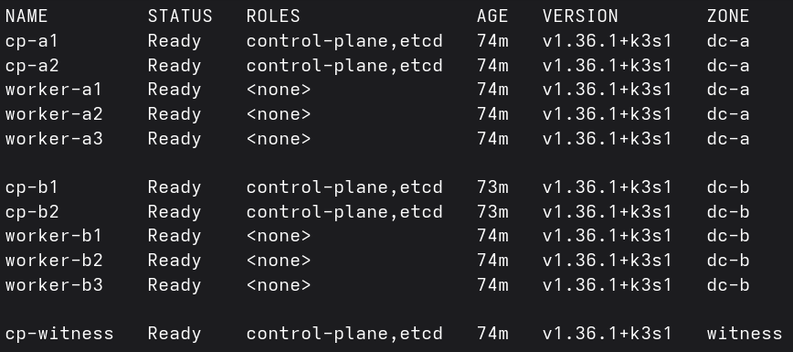
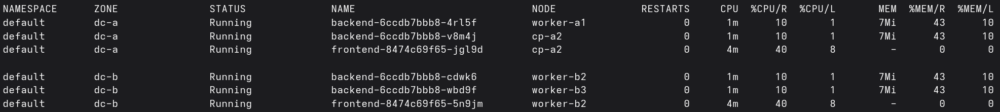
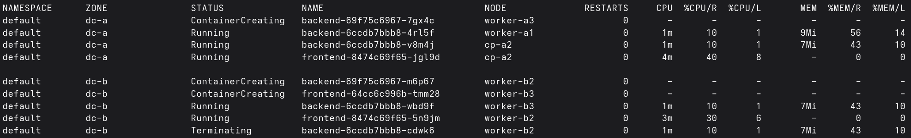

# K9s Show Zones Plugin

A [K9s](https://github.com/derailed/k9s) plugin to display the zone distribution
of **Nodes** and **Pods** based on the `topology.kubernetes.io/zone` Node label;
press `SHIFT+Z` inside the 'Nodes' or 'Pods' view.

This is useful for maintaining **stretched Kubernetes cluster** topologies;
monitoring the distribution of workloads to validate enforcement of topology
spread constraints and effectivness of a
[descheduler](https://github.com/kubernetes-sigs/descheduler).

## Screenshots

All screenshots show examples based on a **tiebreaker** stretched cluster
topology.

### Nodes View

Nodes exist in three zones: dc-a, dc-b, and witness.

### Pods View

Workloads are deployed across two zones: dc-a and dc-b.

### Pods View Mid-Rollout

Workloads are being created and terminated. Terminating instances may negativley
influence topology spread constraint `maxSkew` calculations; a descheduler can
be deployed to correct an invalid skew post-rollout.

